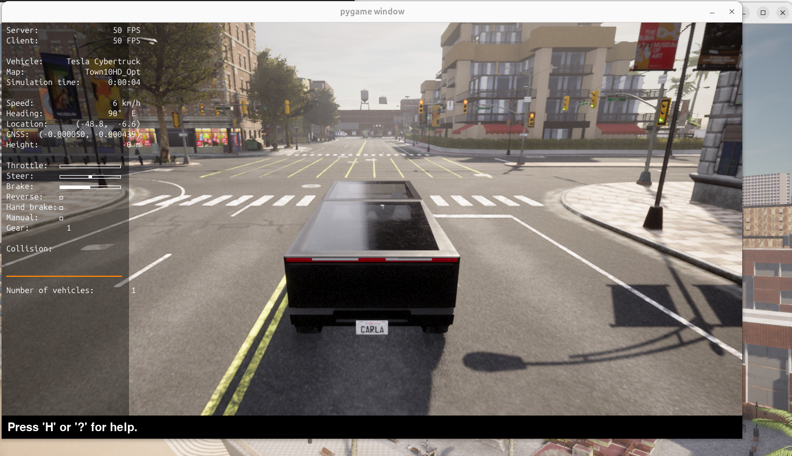

# CARLA Simulator Setup on Ubuntu

This repository is adapted from the **KING paper** and serves as a testbed for experiments and attack examples in CARLA. 
@inproceedings{Hanselmann2022ECCV,
  author = {Hanselmann, Niklas and Renz, Katrin and Chitta, Kashyap and Bhattacharyya, Apratim and Geiger, Andreas},
  title = {KING: Generating Safety-Critical Driving Scenarios for Robust Imitation via Kinematics Gradients},
  booktitle = {European Conference on Computer Vision(ECCV)},
  year = {2022}
}

- The **original implementation** follows the KING paper.  
- A **reimplementation branch** has been added for replication.  
- This version is specifically **reimplemented on CARLA 0.9.15** to ensure compatibility with the newer simulator.  

This README provides step-by-step instructions to set up a working CARLA environment on **Ubuntu**.  
It covers installing dependencies, creating a Python virtual environment, launching the CARLA simulator, and running example Python scripts.  

Reference video: [CARLA Setup Guide (YouTube)](https://www.youtube.com/watch?v=tV6iO8JikTw)  

---

## Example: Spawned Vehicle in CARLA

Here is an example of a vehicle spawned in the CARLA world:



---

## 1. System Requirements

- Ubuntu 20.04 or 22.04 (64-bit)  
- At least 8 GB GPU VRAM (NVIDIA recommended)  
- 20+ GB free disk space  
- Python 3.7 – 3.12  
- Ports **2000–2001** open  

---

## 2. Install System Dependencies and Useful Commands

Update your system and install required packages:

```bash
sudo apt update && sudo apt upgrade -y

# Essential build tools and libs
sudo apt install -y build-essential clang cmake git wget unzip

# Python environment support
sudo apt install -y python3 python3-pip python3-venv python3-dev

# SDL, Vulkan, and graphics libraries (for Unreal engine runtime)
sudo apt install -y libpng-dev libtiff5-dev libjpeg-dev \
                    libxcursor-dev libxi-dev libxinerama-dev \
                    libxxf86vm-dev libvulkan1
