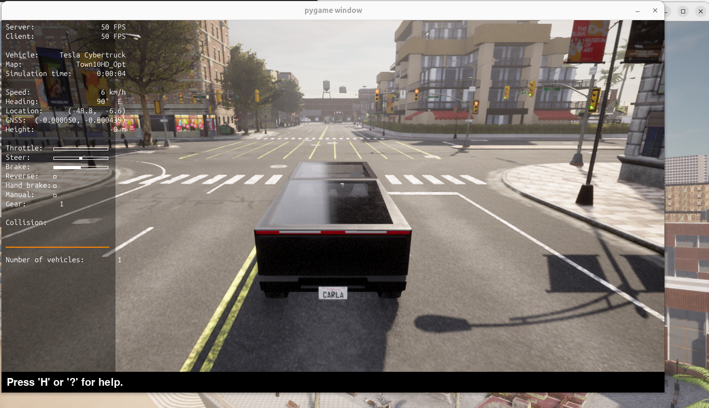

 # CARLA Simulator Setup on Ubuntu

This repository is for building the testbed and attack examples in the CARLA
This README provides step-by-step instructions to set up a working CARLA environment on **Ubuntu**.  
It covers installing dependencies, creating a Python virtual environment, launching the CARLA simulator, and running example Python scripts.
Reference Youtube: https://www.youtube.com/watch?v=tV6iO8JikTw

---
## Example: Spawned Vehicle in CARLA

Here is an example of a vehicle spawned in the CARLA world:




## 1. System Requirements

- Ubuntu 20.04 or 22.04 (64-bit)
- At least 8 GB GPU VRAM (NVIDIA recommended)
- 20+ GB free disk space
- Python 3.7 – 3.12
- Ports 2000–2001 open

---

## 2. Install System Dependencies and useful command

Run the following to update your system and install required packages:

```bash
sudo apt update && sudo apt upgrade -y

# Essential build tools and libs
sudo apt install -y build-essential clang cmake git wget unzip

# Python environment support
sudo apt install -y python3 python3-pip python3-venv python3-dev

# SDL, Vulkan, and graphics libraries (for Unreal engine runtime)
sudo apt install -y libpng-dev libtiff5-dev libjpeg-dev \
                    libxcursor-dev libxi-dev libxinerama-dev \
                    libxxf86vm-dev libvulkan1
download link: https://github.com/carla-simulator/carla/releases/tag/0.9.16/
[Ubuntu] CARLA_0.9.16.tar.gz
[Ubuntu] AdditionalMaps_0.9.16.tar.gz

#quick start https://carla.readthedocs.io/en/latest/ext_quickstart/#import-additional-assets
#https://carla.readthedocs.io/en/latest/start_quickstart/
## 3. run the code

# #go to home Activate it
source carla_venv/bin/activate

#run carla simulator
#to ~/carla_packed_linux/CARLA_0.9.16
DRI_PRIME=1 ./CarlaUE4.sh

#run the example
# to ~/carla_packed_linux/CARLA_0.9.16/PythonAPI/examples$ 
python3 automatic_control.py
#more examples and reference go to


